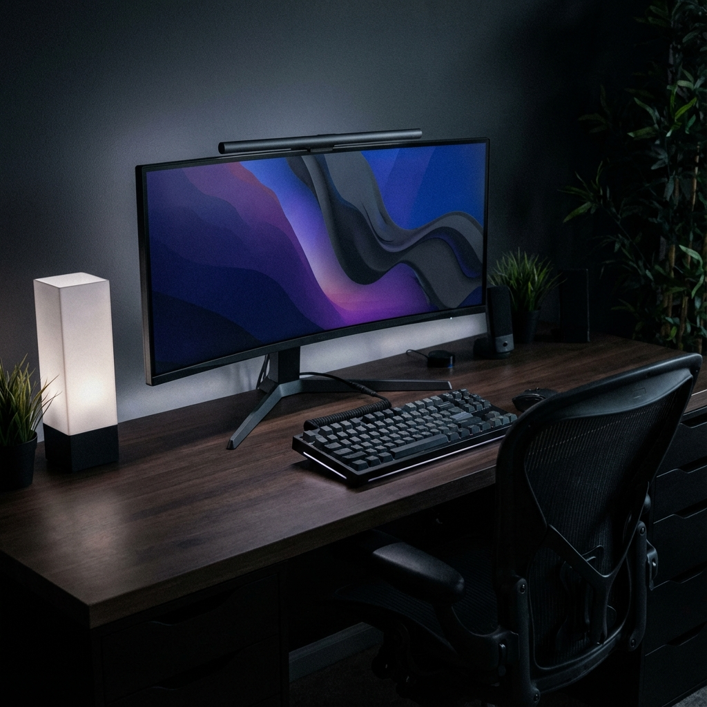

  

 

  <h1 style="font-size: 3em; margin-bottom: 0;">Hi, I'm Anirudh </h1>
  <h3>Backend Engineer | Cloud Enthusiast | System Design</h3>
  
  

    
    &nbsp;
    
  

  
  

    
  

 

## 🚀 About Me

I am a passionate **Backend Engineer** with a strong focus on **Cloud Infrastructure** and **Automation**. I love building reliable, scalable systems and diving deep into **System Design** and **Networking**.

- 🔭 I’m currently working on building scalable backend services.
- 🌱 I’m currently learning **Advanced Cloud Networking** and **AI-Driven Infrastructure**.
- 💬 Ask me about **Node.js, AWS, Docker, and Terraform**.

 

## 🛠️ Skills

### **Languages**

  
  
  
  
  

### **Backend & APIs**

  
  
  
  

### **Cloud & DevOps**

  
  
  
  
  

 

## 💡 Projects

| Project | Description | Tech Stack |
| :--- | :--- | :--- |
| **OTP Authentication Backend** | A robust Node.js authentication service with **OTP-based login**, **10-minute expiry**, and **JWT authorization**. Includes 100% externalized secrets. |   |
| **AWS Multi-Region VPC** | Provisioned secure networking across **2 AWS regions** with VPC peering. Automated creation of **10+ AWS resources** with remote state locking. |   |
| **Secure Static Hosting** | Production-grade static website hosting using **S3 + CloudFront**, serving content over HTTPS. |   |

 

## 📊 GitHub Stats

  
   
  

 

  Built with ❤️ by Anirudh

